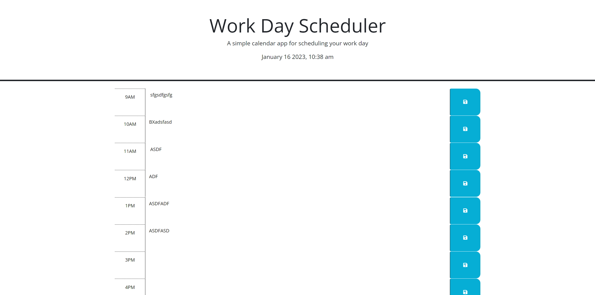

# 05 Work Day Scheduler

https://htranchung.github.io/Work-Day-Scheduler/

 

## Description

- Work Day scheduler    
- Saves written text on localstorage after you press save button
- Shows current date and time according to computers time
- Schedule for 9am-5pm

## Description

N/A

## Usage

A work day scheduler from 9am-5pm. Plan out your day by saving your todos and when page is reopens text is saved after you press save icon.

## Credits

N/A